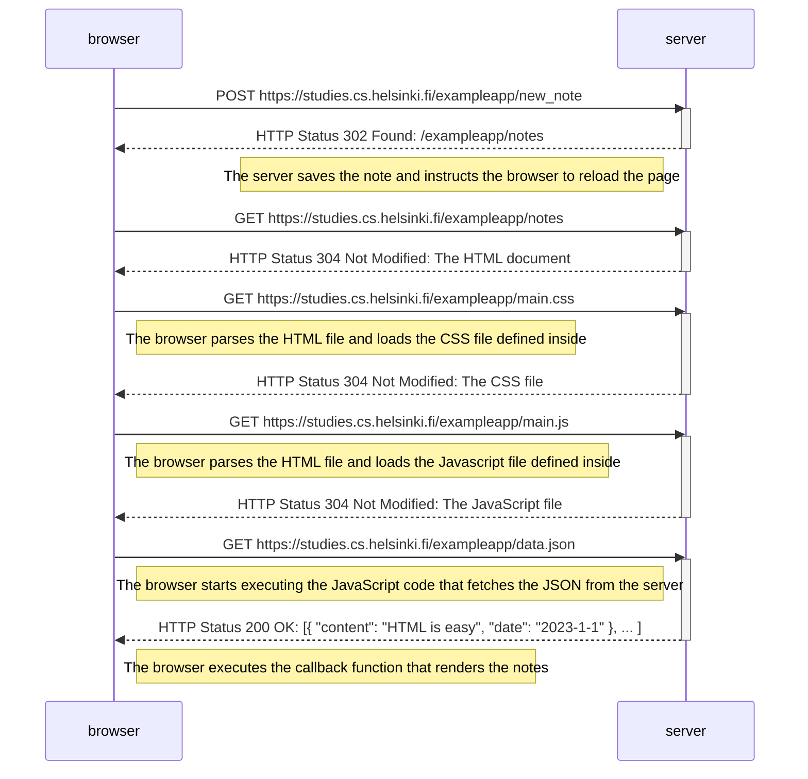

```mermaid
sequenceDiagram
    participant browser
    participant server

    browser->>server: POST https://studies.cs.helsinki.fi/exampleapp/new_note
    activate server
    server-->>browser: HTTP Status 302 Found: /exampleapp/notes
    deactivate server

    Note left of server: The server saves the note and instructs the browser to reload the page

    browser->>server: GET https://studies.cs.helsinki.fi/exampleapp/notes
    activate server
    server-->>browser: HTTP Status 304 Not Modified: The HTML document
    deactivate server

    browser->>server: GET https://studies.cs.helsinki.fi/exampleapp/main.css
    activate server

    Note right of browser: The browser parses the HTML file and loads the CSS file defined inside

    server-->>browser: HTTP Status 304 Not Modified: The CSS file
    deactivate server

    browser->>server: GET https://studies.cs.helsinki.fi/exampleapp/main.js
    activate server

    Note right of browser: The browser parses the HTML file and loads the Javascript file defined inside
    
    server-->>browser: HTTP Status 304 Not Modified: The JavaScript file
    deactivate server

    browser->>server: GET https://studies.cs.helsinki.fi/exampleapp/data.json
    activate server

    Note right of browser: The browser starts executing the JavaScript code that fetches the JSON from the server

    server-->>browser: HTTP Status 200 OK: [{ "content": "HTML is easy", "date": "2023-1-1" }, ... ]
    deactivate server

    Note right of browser: The browser executes the callback function that renders the notes
```