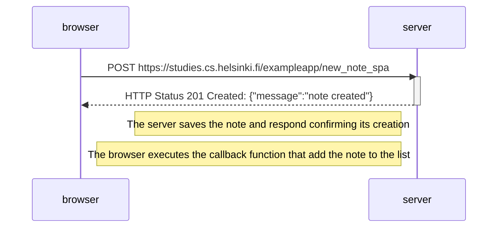

```mermaid
sequenceDiagram
    participant browser
    participant server

    browser->>server: POST https://studies.cs.helsinki.fi/exampleapp/new_note_spa
    activate server
    server-->>browser: HTTP Status 201 Created: {"message":"note created"}
    deactivate server

    Note left of server: The server saves the note and respond confirming its creation

    Note right of browser: The browser executes the callback function that add the note to the list
```